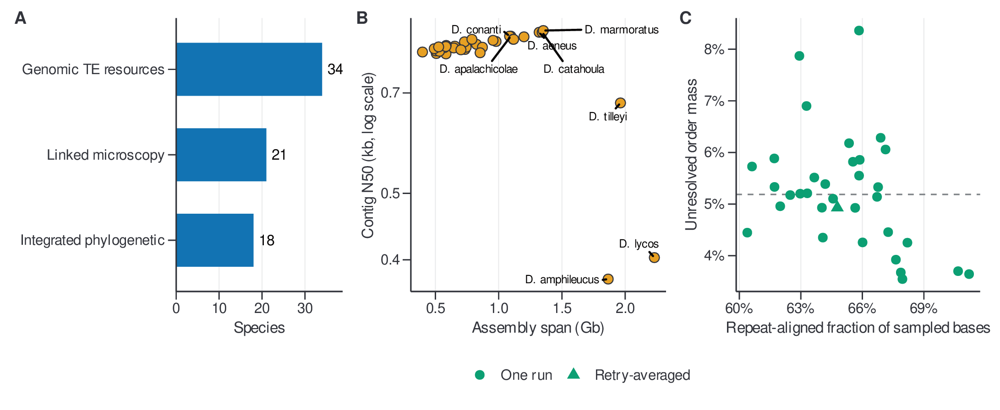
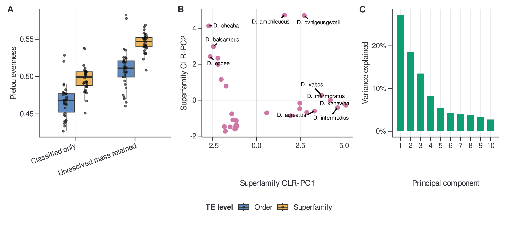
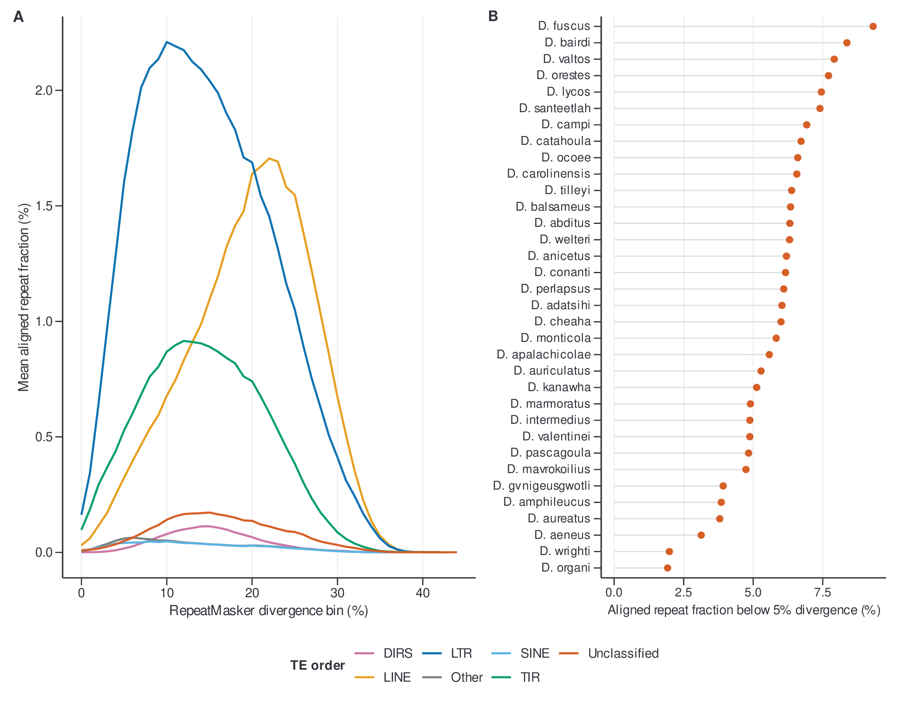
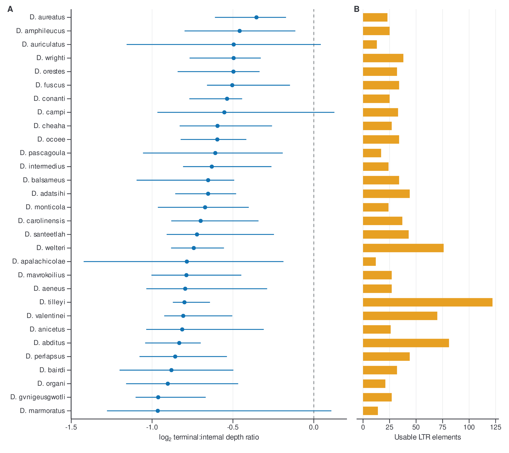
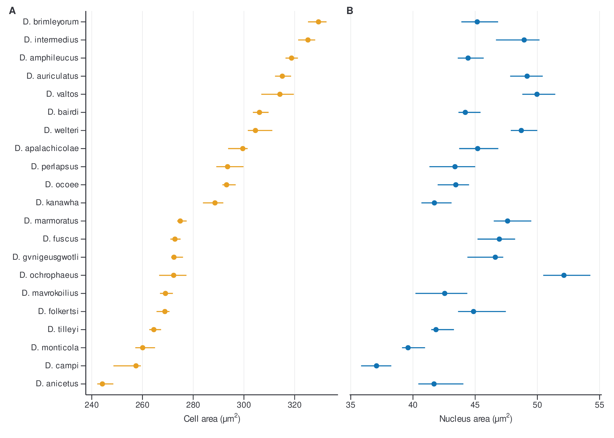
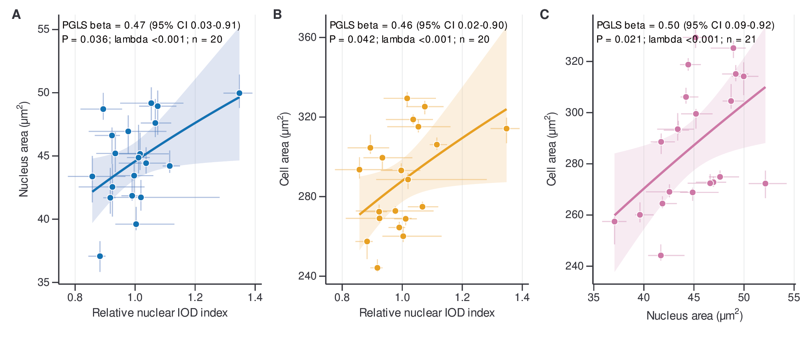
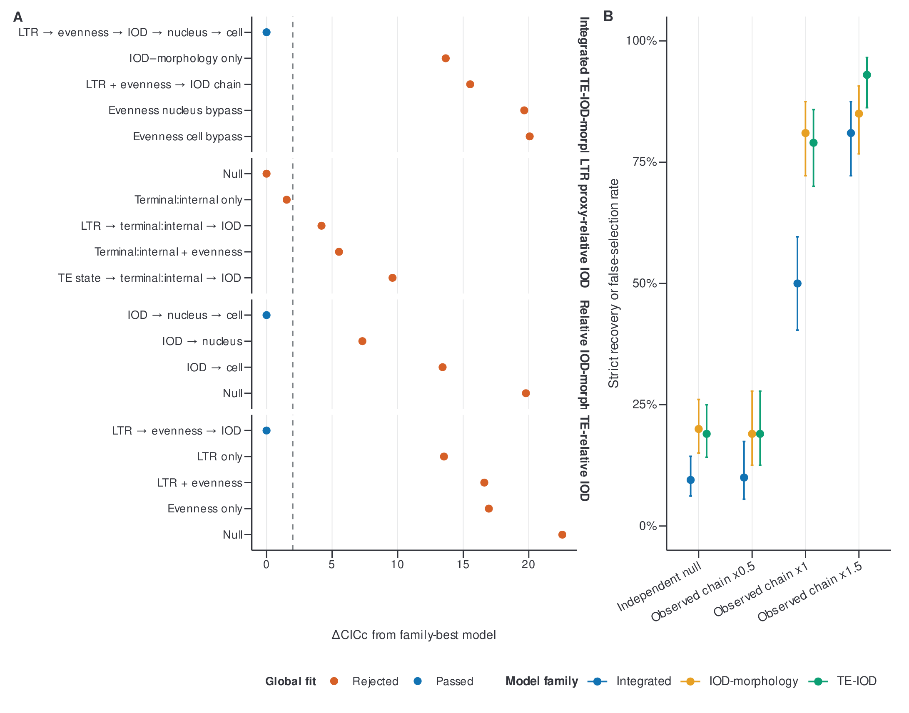

# Materials and Methods

**Genome Biology and Evolution working draft — 13 July 2026**

This document is an evidence-backed working draft assembled from the frozen repository artifacts. Text marked **AUTHOR INPUT REQUIRED** must be completed from laboratory notebooks, collection records, and original command logs before submission. Those details were not recoverable from the analysis repository and have not been inferred. The current image assay supports a relative nuclear integrated-optical-density (IOD) phenotype, but not an independently validated absolute genome size in picograms. Accordingly, absolute genome-size and causal genome-to-cell claims are not made in this draft.

## Study design and analysis-specific species panels

We used separate, prespecified species panels because genomic, microscopy, and phylogenetic data were not available for identical sets of taxa. The genomic transposable-element (TE) resource panel comprised 34 species with an accession-linked short-read resource, assembly resource, and matching tree tip. The linked-microscopy panel comprised 21 species for which reviewed cell and corresponding nucleus masks could be frozen. The integrated phylogenetic panel comprised the exact 18-species intersection of the genomic, microscopy, relative nuclear-IOD, and time-tree datasets. Analyses were performed only on the relevant panel; traits were not imputed to enlarge an analysis. Species names, SRA accessions, assembly accessions, tree-tip mappings, and availability flags are provided in Supplementary Data S1–S4.

Technical reruns were not treated as additional biological observations. The only species with multiple active dnaPipeTE run labels, *D. orestes*, was represented by the equal-weight mean of its run-level estimates. Each species therefore contributed once to species-level genomic summaries. Figure 1 reports the three analysis denominators and principal genomic-resource quality checks.

{width=6.5in}

## Genomic data acquisition and processing

Public genomic resources were joined by an accession-explicit crosswalk. For each species, the frozen crosswalk records the NCBI SRA experiment used for low-coverage read analysis and the assembly accession used for assembly-linked repeat and LTR summaries (Supplementary Data S2 and S5). Assembly span, contig N50, and other available assembly metadata were retained as quality descriptors rather than used to exclude species after observing TE results. Resource identity was defined by the accession in the frozen panel, preventing similarly named taxa or rerun directories from being substituted during downstream processing.

The publication package begins from preserved upstream dnaPipeTE and RepeatMasker outputs. The release-building scripts parsed, audited, and summarized those products but did not rerun read download, read preprocessing, de novo assembly, repeat discovery, RepeatMasker, TEsorter, or read mapping. The exact source and output SHA-256 checksums are recorded in the dataset manifest.

**AUTHOR INPUT REQUIRED — genomic preprocessing.** Insert the read-download date, FASTQ accession layout, adapter/quality-processing program and parameters, contamination screening, read-pair handling, and any subsampling performed before dnaPipeTE. If no preprocessing was used, state that explicitly.

## De novo TE library construction and dnaPipeTE quantification

Low-coverage read-based repeat reconstruction and quantification were performed with dnaPipeTE (Goubert et al. 2015). The preserved output contains reconstructed components, annotations, and the number of aligned bases assigned to each component. Downstream parsing assigned components to TE class, order, and superfamily using the stored dnaPipeTE annotations. For each run, aligned bases were summed across all components to define total repeat-aligned mass. The retained mass at a taxonomic level was the aligned-base sum for components assigned to a valid label at that level; unresolved mass was the difference between the total and retained sums. This generated an explicit mass ledger rather than silently renormalizing away unclassified components (Supplementary Data S6 and S7).

Within each run, classified order and superfamily abundances were closed to sum to one. For *D. orestes*, the original and retry runs were first summarized separately, after which run-level compositions, retained fractions, unresolved fractions, and total aligned-base summaries were averaged with equal weights. This prevented a retry with more aligned bases from receiving greater species-level weight. Other species had one active run.

**AUTHOR INPUT REQUIRED — dnaPipeTE execution.** Insert the dnaPipeTE version or commit, complete command, input-read preprocessing, target sampled coverage or read count, number of independent iterations, random-seed policy, Trinity and RepeatMasker settings used by dnaPipeTE, and repeat-library/database versions. Until supplied, this section documents the audited downstream quantification but not a reproducible upstream de novo-library execution.

## TE composition, diversity, and ordination

We summarized TE order and superfamily composition under two denominator definitions. The classified-conditional composition divided each classified abundance by the sum of classified abundances. The mass-aware composition multiplied classified proportions by the retained aligned-base fraction and added unresolved aligned-base mass as an explicit category. Results from these definitions were kept separate.

For each species, TE level, and denominator definition, we calculated observed richness, Shannon entropy, Gini–Simpson diversity (1 − Σpᵢ²), Hill numbers of orders 1 and 2, and Pielou evenness (H/ln S), where pᵢ is category proportion, H is Shannon entropy, and S is observed richness. The convention for the Simpson-family statistic is stated explicitly because alternative definitions reverse or rescale its interpretation.

Exploratory compositional principal-components analysis (PCA) used classified-conditional order and superfamily compositions. Rows were closed to unit sum. When zeros were present, each zero was replaced with one-half of the smallest positive value in the retained matrix and the row was reclosed. A centered log-ratio (CLR) transformation was then applied, followed by PCA of the centered CLR matrix without variance scaling. Axis signs were oriented deterministically using the feature with the largest absolute loading. PCA was treated as an ordination summary, not as the primary comparative predictor. Supplementary Data S8–S11 contain diversity estimates, scores, explained variance, and loadings. Figure 2 shows denominator sensitivity and superfamily CLR ordination.

{width=6.5in}

## Characterization of the repeat landscape

RepeatMasker alignment outputs were parsed into one hit-level record per reported alignment. Inclusive aligned length was calculated as \(|q_{end}-q_{start}|+1\). Records with missing or negative divergence or nonpositive aligned length were excluded. Missing or blank order labels were assigned to an explicit `Unclassified` category. Percent divergence was floored into one-percentage-point bins, with values above 50% assigned to the terminal bin. Within each species, order and divergence bin, we recorded hit counts and inclusive aligned hit bases. Species-specific fractions used the total aligned RepeatMasker hit bases as their denominator and therefore describe the composition of aligned repeat annotations, not whole-genome occupancy. The compact publication release includes the binned landscape and species inventory (Supplementary Data S12 and S13); the complete hit-level table should be deposited in the associated DOI repository because of its size.

Figure 3 summarizes the across-species divergence distributions of the six orders contributing the most aligned repeat bases and ranks species by the fraction of aligned repeats below 5% divergence.

**AUTHOR INPUT REQUIRED — RepeatMasker execution.** Insert the RepeatMasker version, search engine, command options, library or custom-library identity, and database release that produced the preserved alignments. The parser and denominator are reproducible from the release, but the upstream annotation command is not yet documented completely.

{width=6.5in}

## LTR terminal-to-internal depth as a deletion-footprint proxy

We analyzed terminal-to-internal read-depth variation for assembly-linked LTR retrotransposon candidates as an exploratory deletion-footprint and mapping proxy. It was not interpreted as an ectopic-recombination rate or a direct count of solo LTRs. Candidate elements were linked to TEsorter annotations by their complete sequence-and-coordinate identifier. Elements at least 3,000 bp long and containing exactly five or six expected domains were retained. Among 1,088 selected elements across 30 species, two depth files ended in a demonstrably truncated partial line and were excluded under a fail-closed policy, leaving 1,086 usable elements; 1,083 met the 80% regional positive-coverage sensitivity threshold.

For each element, the left LTR, internal region, and right LTR were defined by the stored LTR coordinates. Unreported genomic positions and explicitly reported zero-depth positions were retained as zero in regional means. Terminal depth was summarized from the two LTR regions and divided by internal-region depth. Species summaries included the median, geometric mean, trimmed and winsorized estimates, 2,000-replicate bootstrap intervals, and leave-one-element-out influence diagnostics. The main display uses the median among elements with at least 80% reported positive-position coverage in each terminal and internal region. Element-level metrics, species robustness results, support counts, and exclusions are supplied in Supplementary Data S14–S17.

**AUTHOR INPUT REQUIRED — read mapping.** Insert the read source, reference sequence, aligner and version, complete mapping command, multimapper policy, MAPQ threshold, treatment of secondary and supplementary alignments, and duplicate policy. Without this provenance and independent structural validation, the statistic remains sensitivity-only.

{width=6.5in}

## Specimen collection

**AUTHOR INPUT REQUIRED.** For every microscopy specimen, provide collection locality, collection date, collector, permit, museum voucher or tissue number, individual identifier, sex and life stage when known, and whether the source was fresh or preserved. State the approving animal-care protocol and institution, relevant national guidelines, and any Nagoya Protocol or biodiversity-access compliance. These fields are necessary to distinguish biological replication from slide, image, and object replication.

## Erythrocyte harvesting

**AUTHOR INPUT REQUIRED.** Provide the blood source and collection method, anticoagulant and concentration, approximate volume, time from collection to smear preparation, storage temperature and duration, and all differences between fresh and preserved specimens. No complete harvesting protocol was recoverable from the analysis repository.

## Slide preparation, fixation, and staining

**AUTHOR INPUT REQUIRED.** Provide the smear method, air-drying period, fixation reagent and concentration, fixation duration, storage conditions, stain identity, acid-hydrolysis concentration, temperature and duration, Schiff-reagent preparation and staining duration if Feulgen staining was used, wash procedure, and batch identifiers. Also state whether samples and a DNA-content standard were stained in the same batch or on the same slide. These details are required because fixation, hydrolysis, staining, and batch variation can change optical-density measurements.

## Microscopy and image acquisition

**AUTHOR INPUT REQUIRED.** Provide microscope manufacturer and model, objective magnification and numerical aperture, illumination and Köhler settings, optical filter or image channel, camera model, sensor bit depth, exposure, gain, gamma, white balance, file format, saturation threshold, detector-linearity assessment, fields per slide, field-selection rule, acquisition date, slide age, and analyst blinding. Pixel-to-area conversion is present in the frozen object tables, but the instrument and acquisition record is incomplete.

## Cell and nucleus segmentation, linkage, and quality review

Brightfield images were partitioned into 4,096 × 4,096-pixel tiles. Preserved production outputs contained Cellpose-derived cell masks and YOLO-derived nucleus masks, together with run manifests, tile origins, source-image paths, and object measurements. Nucleus and cell objects were linked by unique mask overlap. The frozen tables retain cell and nucleus mask paths, labels, centroids, overlap fractions, tile coordinates, and one-to-one linkage flags so every reported pair can be traced to its source image and masks.

Hard eligibility checks required an available cell tile and nucleus mask, a matched cell, a physically plausible cell–nucleus pair, and a one-to-one cell assignment. Shape and focus diagnostics were used to prioritize visual review but did not replace human inspection. Candidate pairs were ranked within species by cell area in descending order. Reviewers labeled problematic masks; accepted masks were retained automatically, and rejected candidates were replaced by the next-largest eligible accepted mask. The frozen panel is the first 50 manual keeps per species after this fixed eligibility and ranking procedure: 1,050 linked cell–nucleus pairs across 21 species (Supplementary Data S18 and S20). Because selection targets the largest accepted cells, the estimand is the upper tail of detected, eligible erythrocytes, not the population mean cell size.

Cell and nucleus areas were calculated from their mask pixel counts using the stored physical-area conversion. Species point estimates were the medians of the 50 frozen pairs. Uncertainty was estimated by 2,000 paired-object bootstrap resamples within species; 2.5th and 97.5th percentiles formed conditional 95% intervals. These intervals quantify object-selection uncertainty conditional on the observed images and specimens and do not represent population-level among-individual sampling uncertainty. Figure 5 reports the 21 species estimates; Supplementary Data S19 is the species summary.

The preserved validation audit evaluated the production cell and nucleus models on two manually labeled test tiles. Cell instance F1 was 0.624 and nucleus instance F1 was 0.687 at intersection-over-union 0.50. Neither tile contained a focal analysis species, and nucleus training and testing tiles came from the same two source images. These scores are therefore diagnostic and do not establish cross-species segmentation performance.

**AUTHOR INPUT REQUIRED — segmentation software.** Confirm the Cellpose version and model, YOLO implementation/version and model weights, any custom training procedure, inference thresholds, and the final model-file hashes from the upstream microscopy workspace.

{width=6.5in}

## Nuclear integrated optical density and relative DNA-content sensitivity

The nuclear-IOD analysis used a separate, frozen image-quality-matched panel. Candidate nuclei were matched across species on log edge sharpness and log relative ring noise, visually reviewed, and replaced only when marked as problematic. The frozen panel contained 721 reviewed nuclei from 41 images/specimens representing 20 species; each species contributed 33–39 nuclei, and no rejected decision was present in the frozen file (Supplementary Data S21).

For each nucleus, integrated optical density was the stored sum-equivalent quantity, algebraically equal to nuclear mask area multiplied by mean optical density. Species estimates first took the median IOD within each image and then averaged image medians, giving each observed image equal weight. We generated 2,000 hierarchical bootstrap replicates by resampling images with replacement and then resampling nuclei within each selected image; percentile intervals were conditional on the observed images/specimens. To provide a dimensionless comparative phenotype, each species estimate was divided by the median estimate across the 20-species panel. Quality balance was assessed with standardized mean differences and Kolmogorov–Smirnov distances for the two matching features; within-species-centered associations between quality features and log IOD were retained as diagnostics (Supplementary Data S22–S25).

The historical workflow also multiplied species-to-*D. fuscus* IOD ratios by 16.36 pg. That conversion is not used as an absolute genome-size measurement in the present draft because the repository lacks the reference-value provenance, a same-batch or co-stained DNA standard, the 1C-versus-2C convention, camera-linearity evidence, and complete slide-linked staining records. A validated absolute genome-size analysis would require those records or an independent flow-cytometric/cytometric calibration. Until then, all comparative analyses use and label the variable as **relative nuclear IOD**, and genome-size causality is outside the claim boundary.

## Time-calibrated phylogeny

Comparative analyses used the repository’s dated *Desmognathus* tree pruned by exact normalized species names to each complete-case panel. Tree-tip, SRA, assembly, and microscopy crosswalks were validated before fitting. The source Newick was ultrametric within 10^-5 Myr but contained rounding-scale root-to-tip differences. Only terminal branches were increased to the maximum root-to-tip depth, preserving topology and internal node ages; no branch was shortened. The focal integrated tree contained 18 tips with positive branch lengths. Sensitivity analyses also used a published main tree and 200 published bootstrap trees where the complete required species set was available (Supplementary Data S27–S29 and S38–S39).

## Pairwise phylogenetic associations among relative nuclear IOD, nucleus area, and cell area

We quantified each pairwise association with maximum-likelihood Pagel-λ phylogenetic generalized least squares (PGLS). Positive species estimates were log10-transformed and standardized to a sample mean of zero and standard deviation of one. For each fit, λ scaled the off-diagonal entries of the Brownian shared-path covariance matrix while retaining its diagonal. λ was optimized over 10^-7 to 1 by profile likelihood. Regression coefficients, residual-degrees-of-freedom standard errors, t tests, 95% confidence intervals, and generalized R² were calculated from the fitted covariance matrix. Analyses included 20 species for relative-IOD comparisons and 21 species for the nucleus–cell comparison. The relative IOD–nucleus and relative IOD–cell fits are sensitivity analyses because IOD and nucleus area are derived from image data and the IOD scale is not independently calibrated. Fit statistics are reported in Supplementary Data S26 and visualized in Figure 6.

{width=6.5in}

## Exploratory phylogenetic path analysis

We evaluated prespecified directed acyclic graph families with phylogenetic confirmatory path analysis using `phylopath` 1.3.1 (van der Bijl 2018). All continuous variables were log-transformed where required and standardized before analysis. The relative nuclear-IOD node was never replaced by the historical picogram conversion. Candidate families represented TE composition–IOD relationships, IOD–morphology relationships, an integrated TE–IOD–nucleus–cell structure, and the terminal-to-internal LTR proxy–IOD relationship. Candidate models were fixed before ranking and included null, direct, mediated, additive, and selected bypass structures (Supplementary Data S30–S36).

For each candidate graph, d-separation generated a minimal set of conditional-independence claims, which were tested using PGLS. Component probabilities were combined with Fisher’s C. A global P value below 0.05 rejected the graph’s implied independence structure. Nonrejected models were compared within, but not across, candidate families using the small-sample C-statistic information criterion, CICc. We report CICc, ΔCICc from the family-best model, CICc weights, global-fit status, and standardized path coefficients with standard errors and approximate 95% intervals. A model was considered competitive when it passed the global-fit gate and had ΔCICc ≤2.

Robustness analyses repeated rankings across six morphology estimators, three relative-IOD quality subsets, leave-one-species-out datasets, the focal and published trees, and eligible bootstrap trees. Actual-tree simulations quantified false non-null selection under independent traits and recovery of prespecified chains at observed effect sizes. These calibration results were treated as release gates, not as proof of a causal mechanism.

The three proposed nucleus-bridge diagrams—IOD → nucleus → cell, cell → nucleus → IOD, and nucleus → IOD plus nucleus → cell—share the same skeleton and no collider. They are Markov equivalent and imply the same conditional-independence claim. Cross-sectional comparative data cannot orient those arrows, even after phylogenetic correction. The path analysis therefore evaluates compatible association structures and whether nucleus area behaves as a statistical bridge; it does not identify causal direction.

{width=6.5in}

## Software, figure production, and reproducibility

Publication datasets were exported from declared frozen sources by `scripts/publication/build_publication_datasets.py`. Every CSV is listed with its analysis section, source path, SHA-256 source and output hashes, dimensions, release status, and intended manuscript use in `Publication/datasets/DATASET_MANIFEST.csv`. The release contains 39 CSV datasets and reviewer-readable node/edge tables for the focal phylogeny. Large hit-level RepeatMasker data and analysis code should be archived in a DOI-bearing repository for submission.

Figures were generated in R from the publication CSVs with `ggplot2` using `scripts/publication/build_gbe_figures.R` and the shared `theme_gbe()` definition. Figures use Nimbus Sans, a metrically compatible Helvetica-family font available on the analysis host, with a minimum target text size of 7 pt, an accessible Okabe–Ito-derived palette, 0.25–1-pt graphical strokes, and journal working widths of 89 or 185 mm. Each figure was exported as an embedded-font CMYK PDF, 300-dpi PNG, and 300-dpi CMYK TIFF. Legends and alt text are stored in `Publication/figures/FIGURE_LEGENDS_AND_ALT_TEXT.md`.

## Data availability

**SUBMISSION PLACEHOLDER.** On acceptance of the final release, the 39 audit-ready CSV files, the focal and uncertainty trees, the complete hit-level RepeatMasker table, source code, environment files, figure source, decision files, and frozen mask-review tables will be deposited in [REPOSITORY] under DOI [DOI]. Public SRA and assembly accessions are listed in Supplementary Data S2 and S5. The repository release will retain the manifest and hashes needed to verify every packaged file.

## Methods references to integrate into the manuscript bibliography

- Goubert C, Modolo L, Vieira C, ValienteMoro C, Mavingui P, Boulesteix M. 2015. De novo assembly and annotation of the Asian tiger mosquito repeatome with dnaPipeTE from raw genomic reads and comparative analysis with the yellow fever mosquito. *Genome Biology and Evolution* 7:1192–1205. https://doi.org/10.1093/gbe/evv050.
- Hardie DC, Gregory TR, Hebert PDN. 2002. From pixels to picograms: a beginners’ guide to genome quantification by Feulgen image analysis densitometry. *Journal of Histochemistry & Cytochemistry* 50:735–749. https://doi.org/10.1177/002215540205000601.
- van der Bijl W. 2018. `phylopath`: Easy phylogenetic path analysis in R. *PeerJ* 6:e4718. https://doi.org/10.7717/peerj.4718.
- von Hardenberg A, Gonzalez-Voyer A. 2013. Disentangling evolutionary cause-effect relationships with phylogenetic confirmatory path analysis. *Evolution* 67:378–387. https://doi.org/10.1111/j.1558-5646.2012.01790.x.

**AUTHOR INPUT REQUIRED — software citations and versions.** Add final citations and versions for RepeatMasker, its search engine and library, TEsorter, the read aligner, Cellpose, YOLO implementation, R, Python, `ggplot2`, and all packages used in the final statistical analysis.
